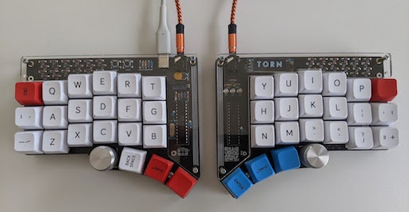
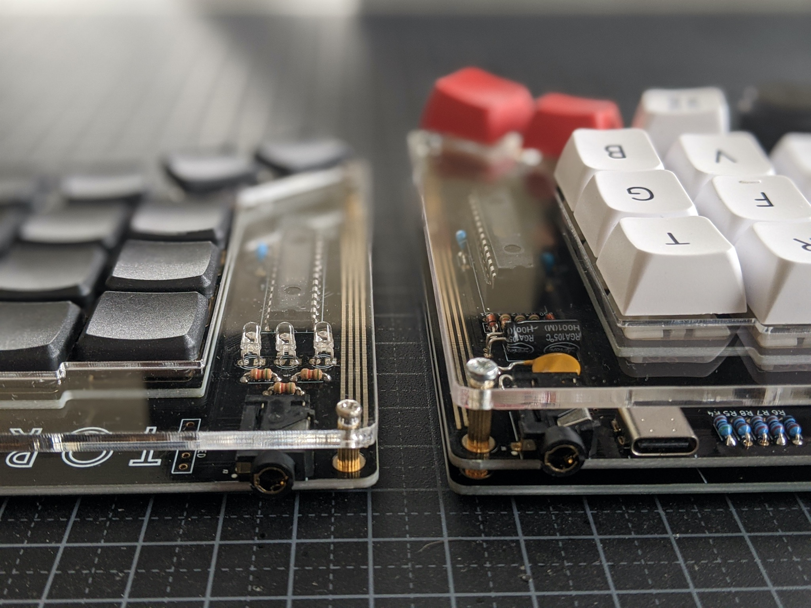
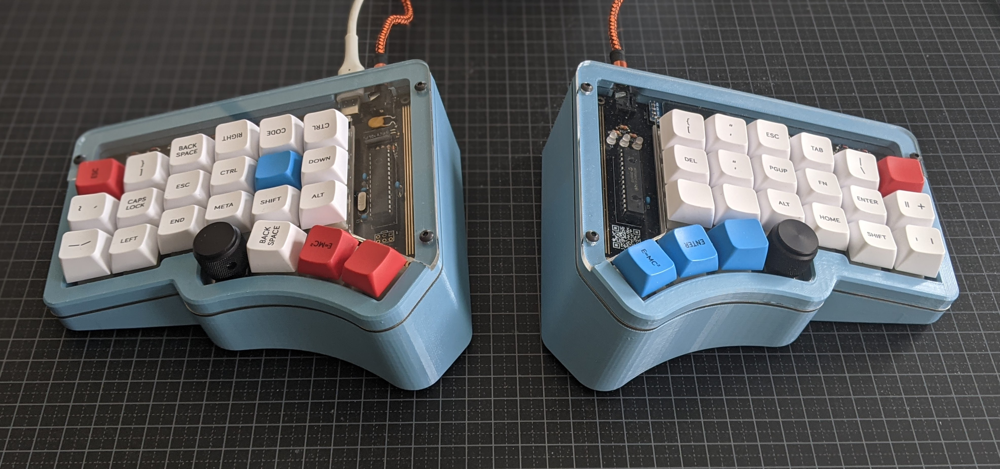
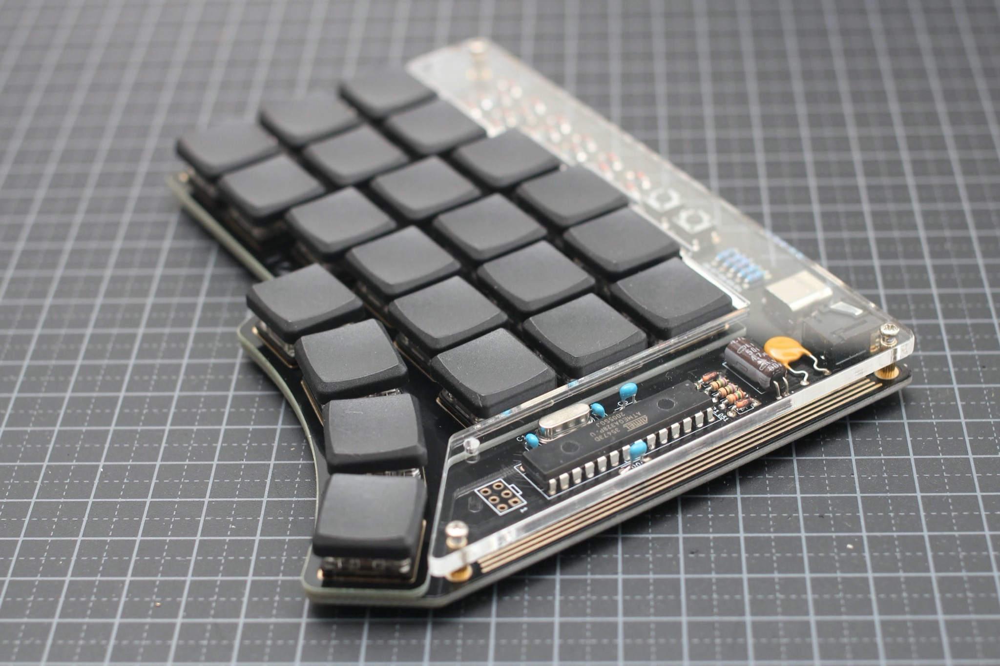
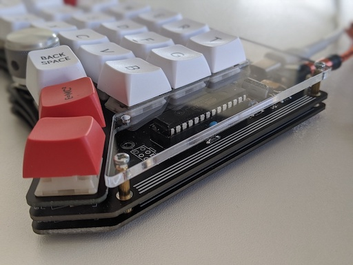
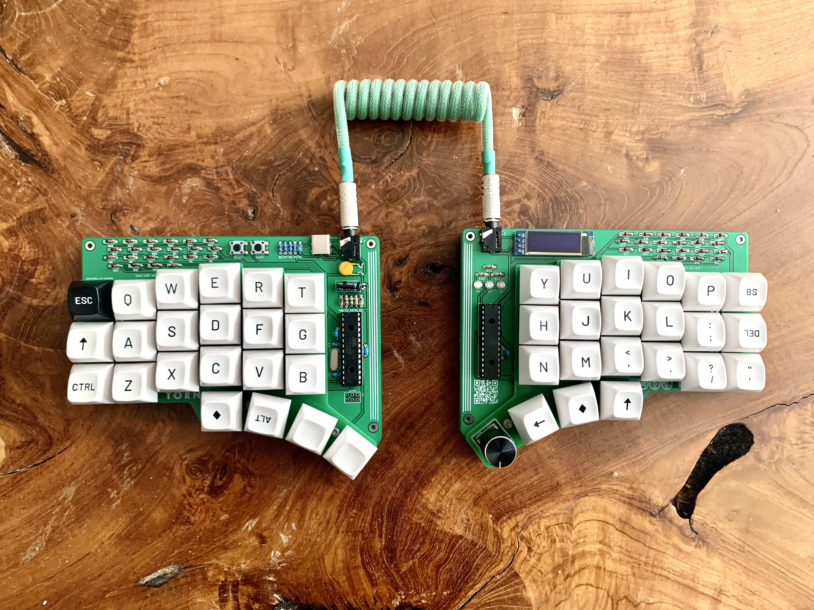
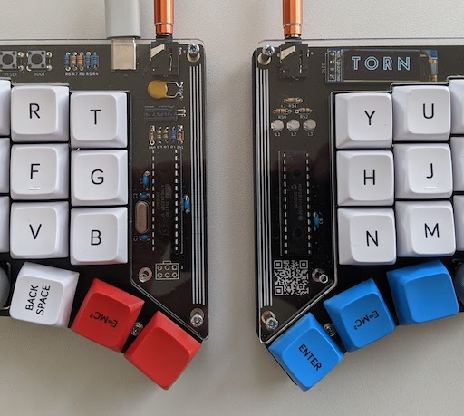
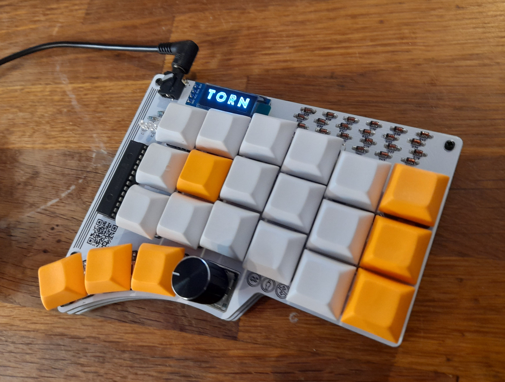

Torn
===============

The split keyboard kit made with through hole components. The design has been inspired by the [Corne](https://github.com/foostan/crkbd), [Plaid](https://github.com/hsgw/plaid) and [Discipline](https://github.com/coseyfannitutti/discipline) keyboards.

Torn uses an Atmega328P cpu, running QMK with VUSB:
- [QMK firmware](https://github.com/qmk/qmk_firmware/blob/master/keyboards/torn/readme.md).
- [Bootloader](https://github.com/rtitmuss/USBaspLoader).
- Compatible with [VIA](https://caniusevia.com/)

## Building your own Torn keyboard

Later this year you will be able to buy a Torn keyboard kit from [splitkb.com](https://blog.splitkb.com/blog/january-2021).
Alternatively you can also buy [all the parts](./doc/bom.md) needed youself.

Instructions are in the [Build guide](./doc/build.md) and [Troubleshooting guide](./doc/troubleshoot.md).
You can ask questions and get help on the [Torn Discord channel](https://discord.gg/mamAqNccju).

There is also a detailed [build log](https://github.com/rafaeldelboni/buildlogs/blob/main/torn-v3.md)
and [video](https://www.youtube.com/watch?v=7WUTQ30Datw). Thanks [rafaeldelboni](https://github.com/rafaeldelboni)! 

## Thanks

It would not have been possible for me to design Torn without the information and designs published by the mechanical keyboard community. So thanks go to ...

### Guides

* [Corne Keyboard build log](https://thomasbaart.nl/2018/11/26/corne-keyboard-helidox-build-log/) was my first step into this rabbit hole ...
* [Keyboard PCB Guide](https://github.com/ruiqimao/keyboard-pcb-guide) a beginners guide to designing a keyboard PCB in KiCad
* [Guide: Keyboard Construction Explained](https://brianlee.blog/2018/11/23/guide-keyboard-construction-explained/)
* [Cheat sheet: Custom keyboard mounting styles](https://thomasbaart.nl/2019/04/07/cheat-sheet-custom-keyboard-mounting-styles/)

### PCB Design

* [KiCad](https://kicad-pcb.org/) for PCB design
* [Split keyboard comparison site](https://jhelvy.shinyapps.io/splitkbcompare/) to iterate on key layout
* [Keyboard layout editor](http://www.keyboard-layout-editor.com/##@_name=Torn%20https%2F:%2F%2F%2F%2Fgithub.com%2F%2Frtitmuss%2F%2Ftorn&author=Richard%20Titmuss%3B&@_x:3%3B&=E&_x:7%3B&=I%3B&@_y:-0.875&x:2%3B&=W&_x:1%3B&=R&_x:5%3B&=U&_x:1%3B&=O%3B&@_y:-0.875&x:5%3B&=T&_x:3%3B&=Y%3B&@_y:-0.875%3B&=Esc&=Q&_x:11%3B&=P&_a:7%3B&=%3B&@_y:-0.375&x:3&a:4%3B&=D&_x:7%3B&=K%3B&@_y:-0.875&x:2%3B&=S&_x:1%3B&=F&_x:5%3B&=J&_x:1%3B&=L%3B&@_y:-0.875&x:5%3B&=G&_x:3%3B&=H%3B&@_y:-0.875&a:7%3B&=&_a:4%3B&=A&_x:11&a:7%3B&=&=%3B&@_y:-0.375&x:3&a:4%3B&=C&_x:7%3B&=,%3B&@_y:-0.875&x:2%3B&=X&_x:1%3B&=V&_x:5%3B&=M&_x:1%3B&=.%3B&@_y:-0.875&x:5%3B&=B&_x:3%3B&=N%3B&@_y:-0.875&a:7%3B&=&_a:4%3B&=Z&_x:11&a:7%3B&=&=%3B&@_y:-0.2749999999999999&x:3%3B&=&_x:7%3B&=%3B&@_r:13&rx:3.5&ry:8.5&y:-5.4&x:-0.5%3B&=%3B&@_r:26&y:-1&x:-0.5%3B&=%3B&@_r:39&y:-1&x:-0.5%3B&=%3B&@_r:-39&rx:11.5&y:-5.4&x:-0.5%3B&=%3B&@_r:-26&y:-1&x:-0.5%3B&=%3B&@_r:-13&y:-1&x:-0.5%3B&=) for your layout
* [Plate & Case Builder](http://builder.swillkb.com/) Generate CAD files from KLE files
* [keyswitches.pretty](https://github.com/daprice/keyswitches.pretty) KiCad library of mechanical keyboard switch footprints 

### QMK Firmware

* [QMK](https://docs.qmk.fm/#/) Quantum Mechanical Keyboard firmware
* [REMAP](https://remap-keys.app/) to easily configure your keyboard online
* [VIA](https://caniusevia.com/) to configure your keyboard

### 3d Design

The following are great resources to get started with keyboard case design:

* [Fusion 360](https://www.autodesk.com/products/fusion-360/personal)
* [65% Keyboard Case Design](https://youtu.be/4P0zfLLblOw)
* [Hinged Box for 3D Printing](https://youtu.be/iSBsBTMsGTk)
* [Snap Fit Cases](https://www.youtube.com/watch?v=E0NVC8xhf3I)
* [Knurling for 3D Printing](https://www.youtube.com/watch?v=jKPbye0XtMk)

### Other Keyboards

I took inspiration from other keyboards I'd used or liked:

* [Kinesis Advantage](https://kinesis-ergo.com/shop/advantage2/) my daily driver and endgame for almost 20 years! Opps! 
* [Corne](https://github.com/foostan/crkbd)
* [Discipline](https://github.com/coseyfannitutti/discipline) (used with permission from [coseyfannitutti](https://github.com/coseyfannitutti/))
* [Plaid](https://github.com/hsgw/plaid)
* [Lily](https://docs-gitbook.keeb.io/docs/iris-rev3-build-guide)
* [Dactyl](https://raw.githubusercontent.com/adereth/dactyl-keyboard/master/guide/circuit-diagram.png)

## License

The Torn Keyboard is licensed under [Creative Commons Attribution-NonCommercial 4.0 International License](https://creativecommons.org/licenses/by-nc/4.0).

This PCB design may be freely reproduced, modified, and manufactured for personal use only. If you would like to use this design commercially please contact me at richard.titmuss@gmail.com to request permission.
 
## Gallery

