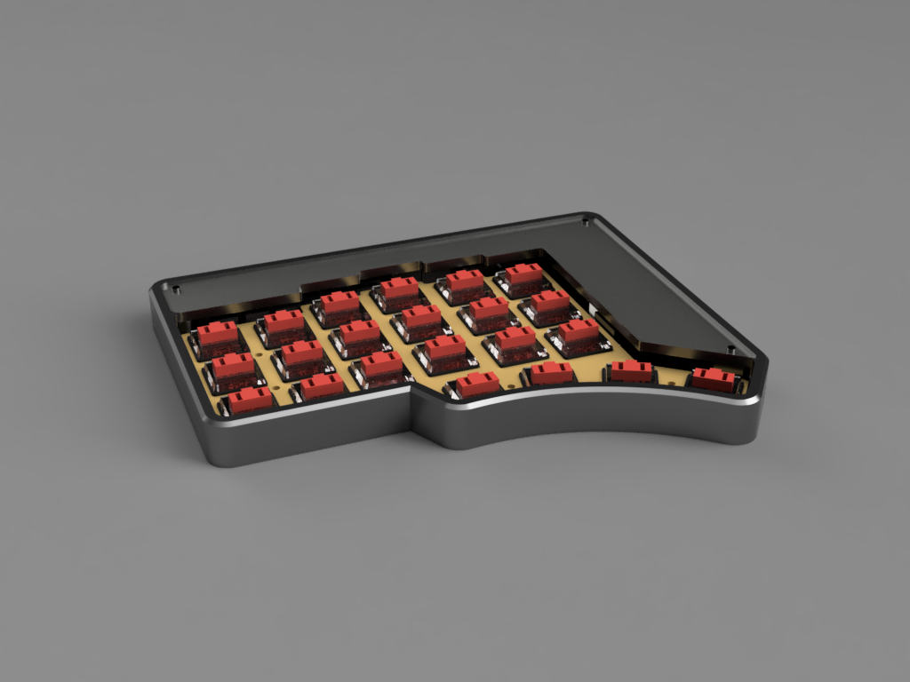

# Torn Choc Case

_This is an early release, expect iterations._

This 3D printed case is designed for Kailh Choc switches.

## Parts

To complete the Choc Case you need:

- Assembled Torn PCBs with Kailh Choc switches
- 3d printed parts using the STLs below
- 2 x acrylic covers
- 6 x m2 nuts
- 6 x m2 x 12mm cheese head screws

## STLs

You need to 3d print the following parts:

- [Left Base](./Torn%20Choc%20Case%20Left%20Base.stl)
- [Left Top](./Torn%20Choc%20Case%20Left%20Top.stl)
- [Right Base](./Torn%20Choc%20Case%20Right%20Base.stl)
- [Right Top](./Torn%20Choc%20Case%20Right%20Top.stl)

You do not need to change the orientation of the files on the print bed. The left and right tops
need printing with supports. The tolerances have been designed to work with a Prusa i3 Mk3S+ printing
in PETG.

<!---
TODO pictures of parts on print bed
-->

## Build guide

Before assembling the Choc Case you need to have assembled the [Torn PCBs](../../doc/pcb.md).

**Do not use the IC sockets (steps 13 and 22 in the main instructions). The ATMega328P and MCP23017 
must be directly soldered to the PCB. This is needed to reduce the height.**

<!---
TODO what about the OLED?
-->

Complete the following steps for the left and right sides of your keyboard.

## Step 1

Place the pcb plate on the main pcb, and insert a few Choc switches. Make sure everything fits correctly.
Then add the remaining switches.

## Step 2

Check that the switches are all inserted correctly, then solder the switches.

## Step 3

Insert the completed pcb in the top of the case.

<!---
TODO picture
-->

## Step 4

Insert three m2 nuts in the base of the case. Tighten an m2 screw to pull the nuts securely into the
base. Remove the screw afterwards.

<!---
TODO picture
-->

## Step 5

Assemble the base and the top of the case. This is a snap fit, so work around the edges until the
case is completely closed.

<!---
TODO picture
-->

## Step 6

Add the acrylic cover. Secure with three 12mm m2 screws.

<!---
TODO picture
-->
