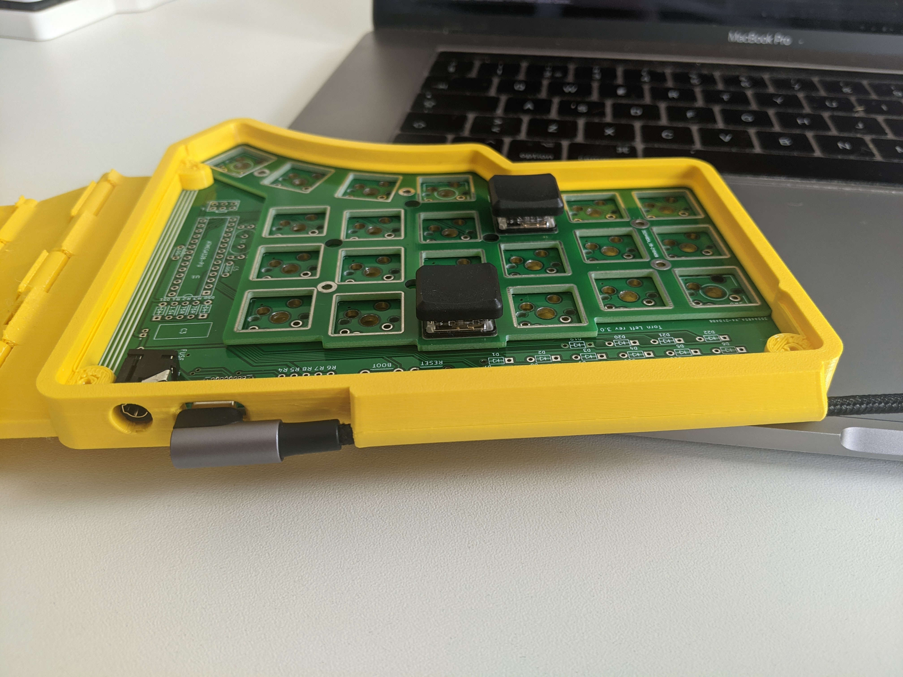
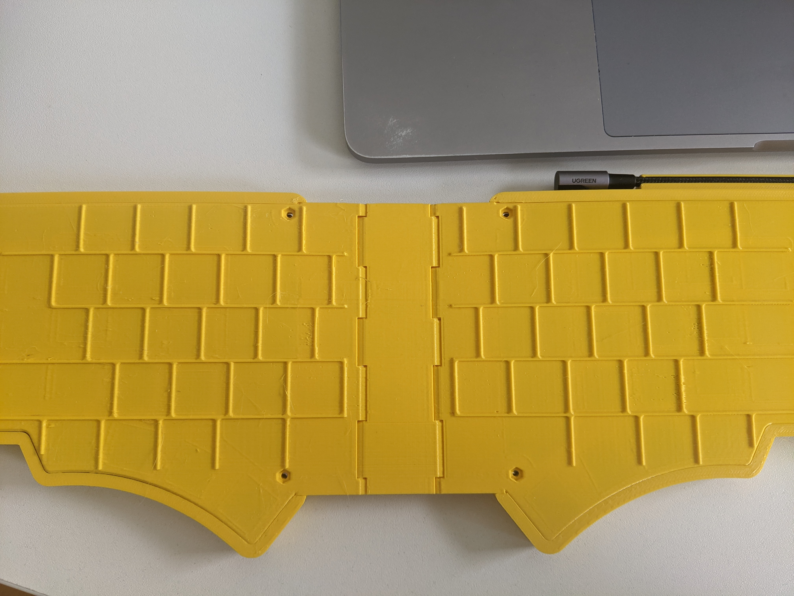

# Torn Travel Case

_This is an early release, expect iterations._

This 3D printed travel case is designed for Kailh Choc switches, featuring a print in place hinge
with internal wiring.

There are two versions of this case. The first is a basic folding travel case. The second version is
designed to be used with a 15 inch 2017 Macbook Pro and features integrated cable routing: 

The Macbook version also includes guides to position the case over the Macbook keyboard:

## Parts

To complete the Travel Case you need:

- Assembled Torn PCBs with Kailh Choc switches
- 3d printed parts using the STLs below
- 4 wires
- 2 x acrylic covers
- 6 x m2 nuts
- 6 x m2 x 12mm cheese head screws
- UGREEN USB C to USB C Cable _Right Angle 90 Degree_ (Optional, for Macbook version)

## STLs

You need to 3d print the following parts for the basic travel case:

- [Base](./Torn%20Laptop%20Case%20-%20Base.stl)
- [Left Top](./Torn%20Laptop%20Case%20-%20Left.stl)
- [Right Top](./Torn%20Laptop%20Case%20-%20Right.stl)

The 15 inch 2017 Macbook Pro version needs:

- [Macbook Pro Base](./Torn%20Laptop%20Case%20-%20Base%20Apple%20Macbook%20Pro.stl)
- [Macbook Pro Left Top](./Torn%20Laptop%20Case%20-%20Left%20Apple%20Macbook%20Pro.stl)
- [Macbook Pro Right Top](./Torn%20Laptop%20Case%20-%20Right%20Apple%20Macbook%20Pro.stl)

You do not need to change the orientation of the files on the print bed. The left and right tops
need printing with supports. _Do not use supports for the base_. The tolerances have been designed
to work with a Prusa i3 Mk3S+ printing in PETG.

<!---
TODO pictures of parts on print bed
-->

When the base is printed you need to carefully open the hinges. Do not use too much force or the
hinges may break. Once free open and close the hinges a few times until they move smoothly. 

## Build guide

Before assembling the Choc Case you need to have assembled the [Torn PCBs](../../doc/pcb.md).

**Do not use the IC sockets (steps 13 and 22 in the main instructions). The ATMega328P and MCP23017 
must be directly soldered to the PCB. This is needed to reduce the height.**

<!---
TODO what about the OLED?
-->

<!---
TODO picture
-->

## Step 1

Place the pcb plate on the main pcb, and insert a few Choc switches. Make sure everything fits correctly.
Then add the remaining switches.

<!---
TODO picture
-->

<!---
TODO picture
-->

## Step 2

Check that the switches are all inserted correctly, then solder the switches.

<!---
TODO picture
-->

Complete Step 1 and Step 2 for both the left and right sides before proceeding.

## Step 3

Insert six m2 nuts in the base of the case. Tighten an m2 screw to pull the nuts securely into the
base. Remove the screw afterwards.

<!---
TODO picture
-->

## Step 4

Solder four wires to the TRRS pins on the left pcb. The wires should be on the underside of the pcb.

<!---
TODO picture
-->

## Step 5

Insert the completed left pcb in the top left of the case.

<!---
TODO picture
-->

## Step 6

Carefully feed the wires through the hinge. There is little clearance in the case underneath the pcb
so _the wires must not cross_. (A future version of this guide will provide more instructions, for now
this is left as an exercise for the reader :)).

<!---
TODO picture
-->

## Step 7

Assemble the left side the case. This is a snap fit, so work around the edges until the case is
completely closed. Check that the wires are not trapped, and that the hinge works smoothly.

<!---
TODO picture
-->

## Step 8

Insert the completed right pcb in the top right of the case.

<!---
TODO picture
-->

## Step 9

Solder the four wires to the right pcb. You need to solder the wires to the TRRS and OLED pins to
make sure that the wires do not cross. Make sure you solder the wires correctly. (A future version
of this guide will provide more instructions, for now this is left as an exercise for the reader :)).

<!---
TODO picture
-->

## Step 10

Assemble the left side the case. This is a snap fit, so work around the edges until the case is
completely closed. Check that the wires are not trapped, and that the hinge works smoothly.

<!---
TODO picture
-->

## Step 11

Check the TRRS wiring. You can do this with a multimeter set to test the continuity.

| ATmega328P | MCP23017 | Signal  |
| ---------- | -------- | ------  |
| Pin 7      | Pin 9    | Vcc     |
| Pin 8      | Pin 10   | Gnd     |
| Pin 28     | Pin 12   | I2C_SCL |
| Pin 27     | Pin 13   | I2C_SDA |

You can refer to the [troubleshooting guide](../../doc/troubleshoot.md) to see the pinouts.

<!---
TODO picture
-->

## Step 12

Add the acrylic covers. Secure with six 12mm m2 screws.

<!---
TODO picture
-->
