# Torn Wedge Case

The Wedge Case has been designed for the Torn keyboard. It has been designed as a premium case option,
with am angled 3D printed case and a steel plate.

The case is manufactured for your individual requirements. You can choose a tenting angle between 7 
degrees to 30 degrees. The case can be made in a color of your choice, it is possible to try to match
the color to your keycaps. Prices start from €150 plus shipping. Please contact me at 
richard.titmuss@gmail.com for more information.

## What's included

The following parts are included in the Torn Wedge Case kit:

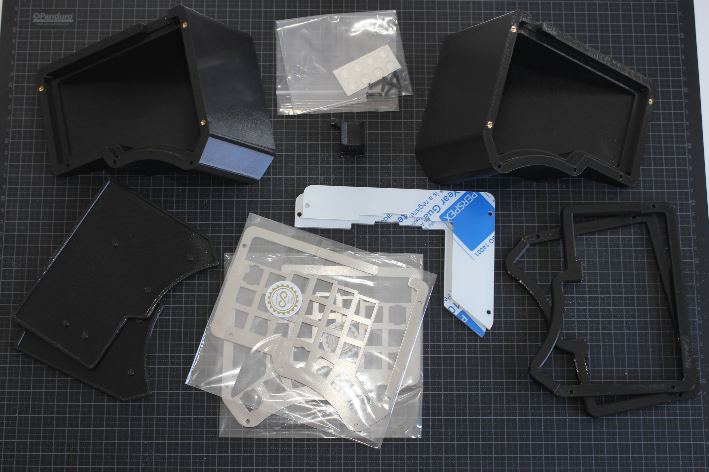

* 2 x base (3D printed)
* 2 x insert (3D printed)
* 2 x trim (3D printed)
* 2 x steel plate
* 2 x acrylic cover
* 8 x bumper feet
* 12 * M3 screws
* cali cat

You need a 2mm allen key (not included) for assembly.

## Finish

Care is taken during the manufacturing of the Wedge Case to produce the best possible finish, but
the Wedge Case is 3D printed which means that fine layer lines will be visible in the surface finish.

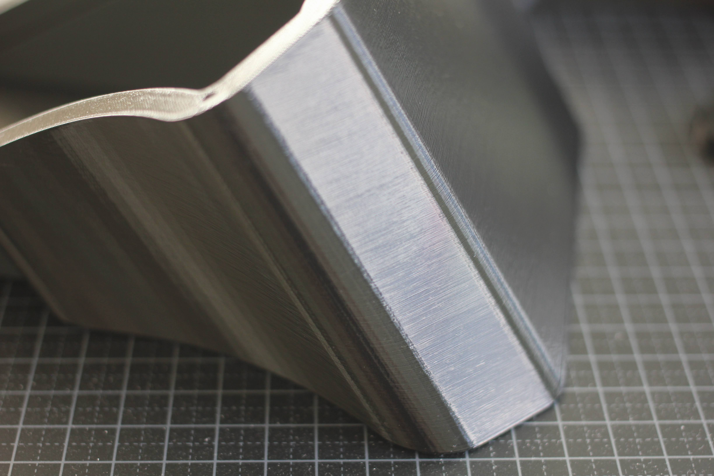

A [cali cat](https://www.thingiverse.com/thing:1545913) is included with the kit in case you want to
experiment with a smoother finish. The case is printed using PETG plastic, you can read about
different options for [getting the perfect finish](https://all3dp.com/2/petg-smoothing/). 

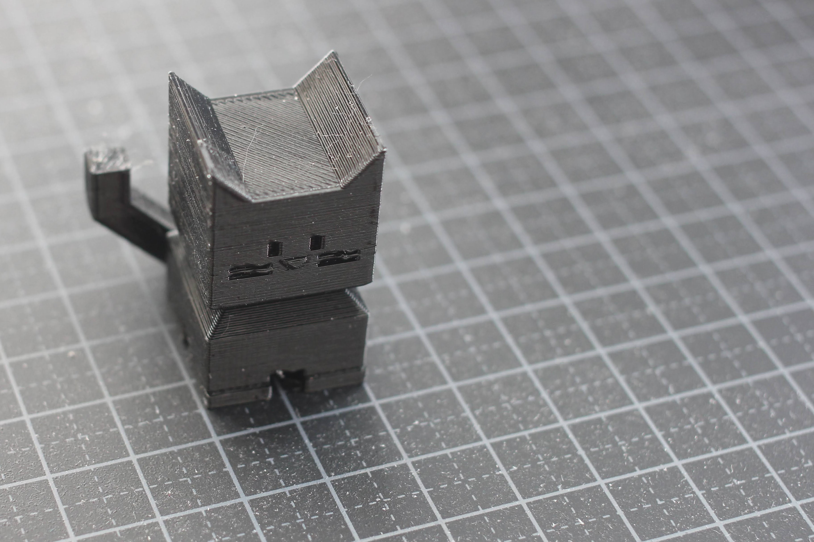

Threaded brass inserts are used for a secure and wear resistant assembly. 

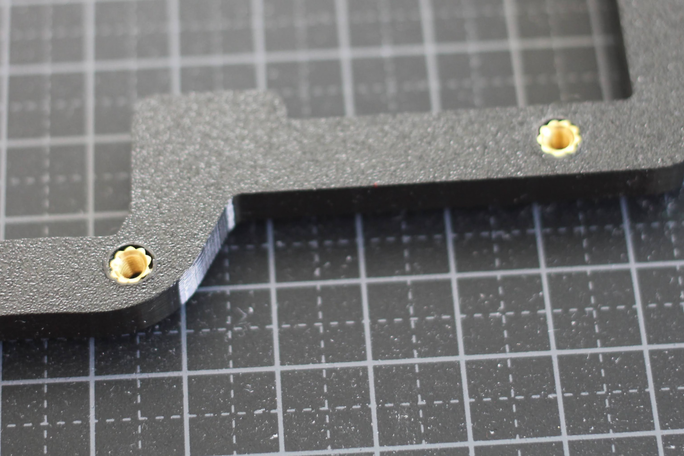

The case has room for the TRRS and USB C connectors to attach to the PCB.

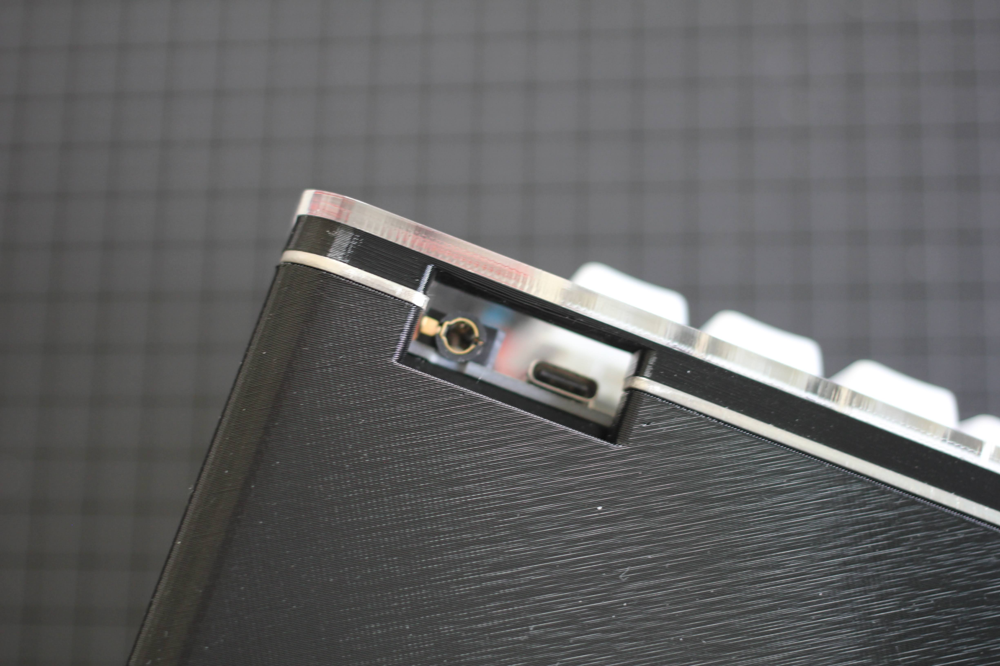

## Build Guide

Before assembling the Wedge Case you need to have completed the [Torn PCBs](../../doc/build.md). Complete
the following steps for the left and right sides of your keyboard.

### Step 1

The assembled Wedge weights about 500g. If you want to add some weight for a quality feel and to
make sure it won't more around your desk you can add some extra weight at the bottom of the case.

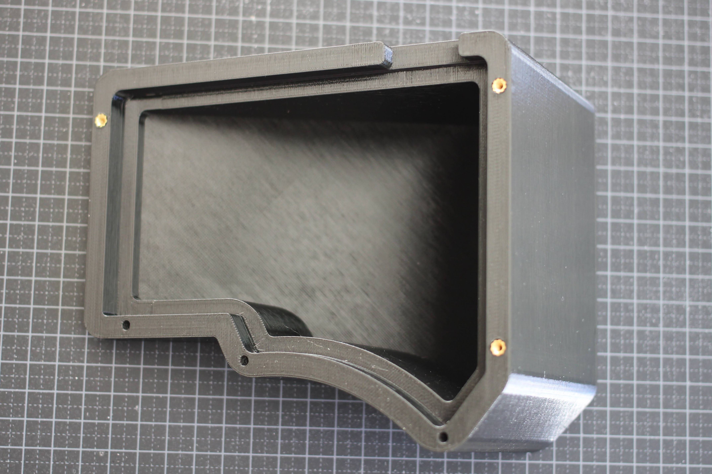

## Step 2

Press the insert firmly into the base. This is designed to be a tight fit, and it is important that
the insert is correctly seated.

Be careful if you need to remove the insert; you can use a small screwdriver to pry the insert up
by the connector gap.

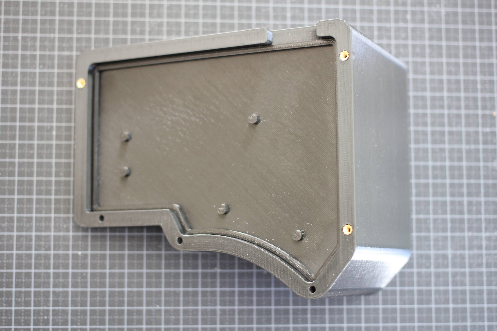

## Step 3

Remove the steel plate from the protective wrapper.

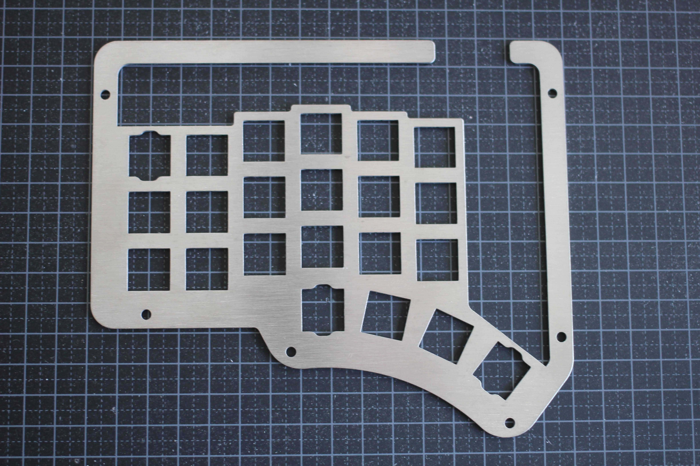

## Step 4

Insert some MX switches in the steel plate and attach the completed PCB. Be careful not to bend the
switch pins.

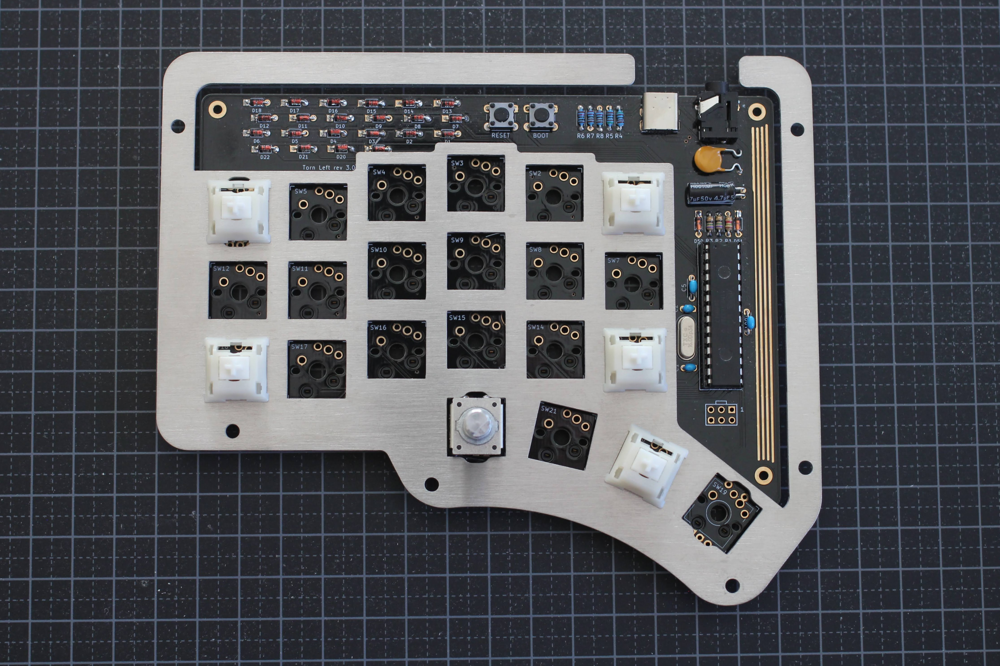

## Step 5

Add the rest of the MX switch. Be careful not to bend the switch pins.

If you are not using Kailh sockets, you need to solder the switches to the PCB. You might want to
test all the switches are working before proceeding.

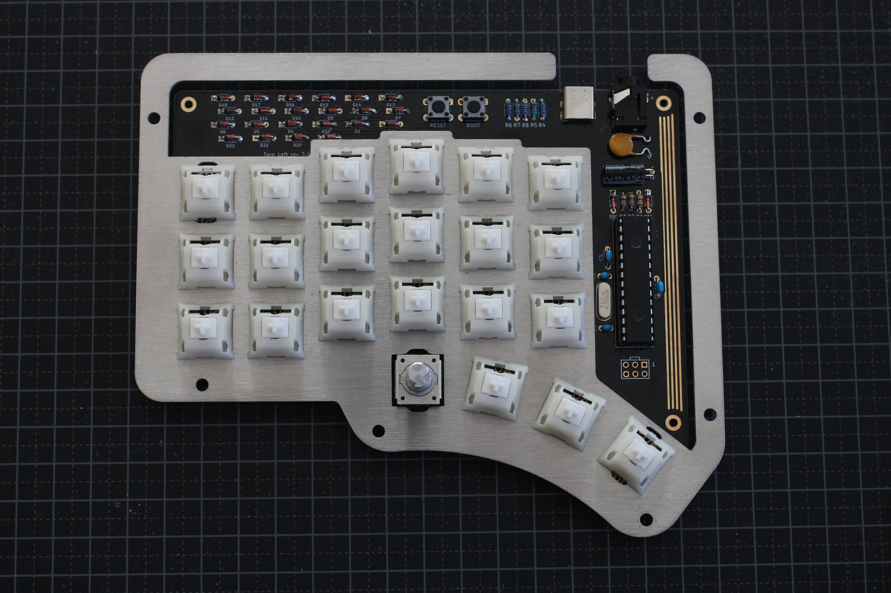

## Step 6

Put the steel plate and PCB assembly on the Wedge.

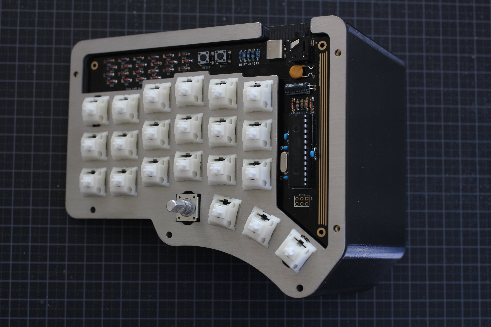

## Step 7

Put the trim over the steel plate. Remove the protective sheet on the acrylic cover and place it
over the trim. Use three M3 screws to secure the acrylic cover.

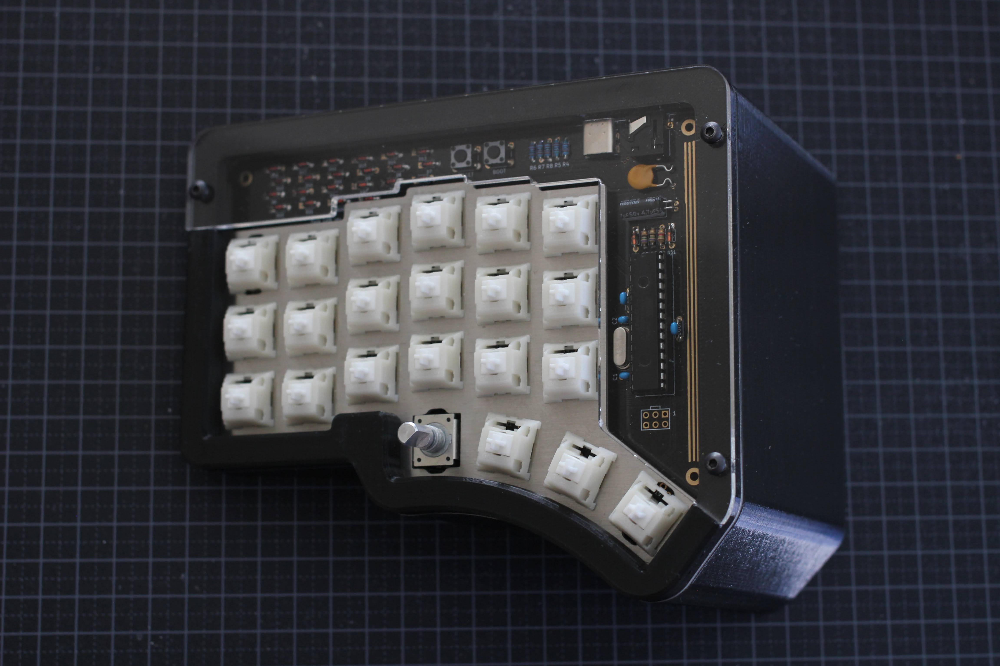

## Step 8

Turn the case over and using three M3 screws to secure the trim. Add four bumper feet.

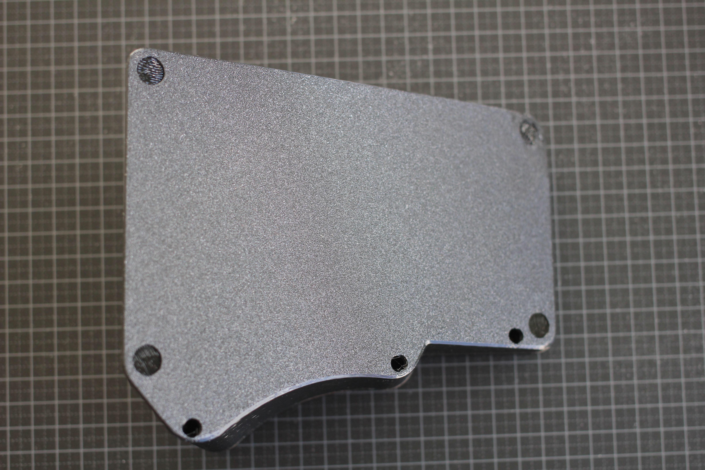

## Step 9

Add the keycaps and enjoy your new keyboard!

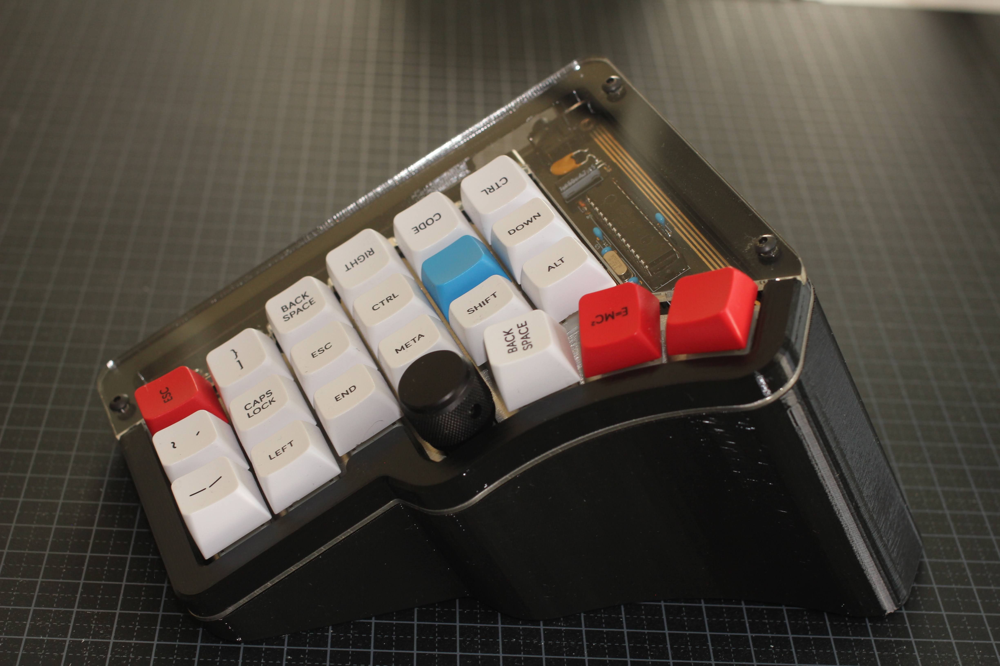
