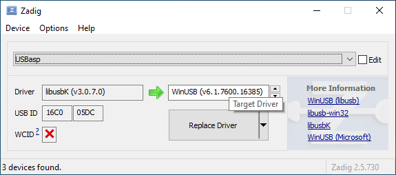

# Flashing the bootloader

If you bought the Torn Keyboard kit the ATmega328P has already been programmed, otherwise if you purchased your own components you need to follow this section of the guide.

This guide shows you how to use an [Arduino Uno](#Arduino-Uno-as-ISP) or an USBasp (on [Linux](#USBasp-as-ISP-on-Linux) / [Windows](#USBasp-as-ISP-on-Windows)) to program the keyboard. You can use other ISP programmers that are supported by avrdude.

You can check the [troubleshooting guide](troubleshoot.md#flashing-atmega328p) if you have problems programming the bootloader.

## Downloading the bootloader

Download the USBaspLoader source code from [https://github.com/rtitmuss/USBaspLoader/tree/torn](https://github.com/rtitmuss/USBaspLoader/tree/torn) by clicking on the green `Code` button and then on `Download ZIP`. Unzipp the files. 

You may need to modify the `PROGRAMMER` setting in `Makefile.inc` if you are using a different ISP programmer or OS. The next sections will skim over what to edit in case you are using an Arduino or a USBasp.

## Arduino Uno as ISP

First you need to program the Arduino Uno as an ISP, as described in Load the Sketch at [https://www.arduino.cc/en/Tutorial/ArduinoISP#toc5](https://www.arduino.cc/en/Tutorial/ArduinoISP#toc5).


### Wiring the programmer

You can use an Arduino Uno to program the AMegta328P with the ISP header on the right PCB. You need to connect the following pins:


Arduino Uno | Torn Keyboard
----------- | -------------
ICSP Pin 1 - MISO | ICP Pin 1 - COL4
ICSP Pin 2 - +Vcc | ICP Pin 2 - +5V
ICSP Pin 3 - SCK | ICP Pin 3 - COL3
ICSP Pin 4 - MOSI | ICP Pin 4 - COL5
ICSP Pin 5 - Reset | -
ICSP Pin 6 - Gnd | ICP Pin 6 - GND
Digital Pin 10 | ICP Pin 5 - Reset

The Arduino Uno board needs a 10µF electrolytic capacitor connected to RESET and GND with the positive (long leg) connected to RESET. The capacitor has to be placed after the programmer board has been loaded with the ISP sketch.


### Flashing

You may need to change the path to your Arduino in the `Makefile.inc`. Replace the path in line 41 `/dev/cu.usbmodem*` with your own.
```
41:     PROGRAMMER = -c avrisp -P /dev/cu.usbmodem* -b19200
```
Make sure to save your changes before continuing. 

Navigate to your unzipped `USBaspLoader-torn` folder and open a terminal window at that location. You can now flash the bootloader using:

```
    make
    make flash
    make fuse
```

Once the bootloader has been flashed to the board, disconnect the Arduino Uno.


## USBasp as ISP on Linux

> This section has been tested on Ubuntu Desktop version 20.10. If you don't have Ubuntu installed, you can run it from a [bootable USB stick](https://ubuntu.com/tutorials/create-a-usb-stick-on-windows#1-overview) without touching your current OS.


### Installing the required packages

1. Open a new Terminal window
2. run `sudo add-apt-repository universe`, press Enter when prompted.
3. run `sudo apt-get update`
3. run `sudo apt-get install avr-libc binutils-avr gcc-avr avrdude make`, press Y when prompted

### Testing your USBasp

Plug the USBasp into your computer. Connect the ribbon cable between your USBasp and the ISCP header on your keyboard. Make sure that the ribbon cable notch faces the right way.

Run `avrdude -c usbasp -p atmega328p` in your Terminal.

If everything is working you should get a message similar to this one: 

```
    avrdude: AVR device initialized and ready to accept instructions

    Reading | ################################################## | 100% 0.00s

    avrdude: Device signature = 0x1e950f (probably m328p)

    avrdude: safemode: Fuses OK (E:FC, H:D0, L:D7)

    avrdude done.  Thank you.    
```


### Flashing

Go into your previously downloaded and unzipped `USBaspLoader-torn` folder and edit `Makefile.inc`. Uncomment Line 40. Comment out Line 41. 

```
39:     # PROGRAMMER = -c pony-stk200
40:     PROGRAMMER = -c usbasp
41:     # PROGRAMMER = -c avrisp -P /dev/cu.usbmodem* -b19200
```
Make sure to save your changes before continuing. 

Navigate to your unzipped `USBaspLoader-torn` folder and open a terminal window at that location. You can now flash the bootloader using:

```
    make
    make flash
    make fuse
```

Once the bootloader has been flashed to the board, disconnect the USBasp.


## USBasp as ISP on Windows

> This section has been tested on Windows 10 version 20H2.


### Installing the required programs

If you don't have `QMK MSYS` already installed on your computer, go [HERE](https://msys.qmk.fm/) and install the latest version. Follow the `Get Started` section and come back here when you are done. You will also need `QMK MSYS` later if you want to create your own keymap.
1. Make sure `QMK MSYS` is installed.
2. Download [Zadig](https://zadig.akeo.ie/). You will need this program to install the correct driver for your USBasp on Windows.
3. Plug your USBasp into your computer.
4. Start Zadig and select `List all Devices` under `Options`.
5. You should now be able to select `USBasp`in the drop down menu.
6. Make sure `WinUSB`is selected as replacement driver.
7. Click on `Replace Driver` to start the progress and wait until it's done.
8. Close Zadiq. Unplug your USBasp.





### Testing your USBasp

Plug the USBasp into your computer. Connect the ribbon cable between your USBasp and the ISCP header on your keyboard. Make sure that the ribbon cable notch faces the right way.

Open `QMK MSYS` and run `avrdude -c usbasp -p atmega328p`.

If everything is working you should get a message similar to this one: 


### Flashing

Go into your previously downloaded and unzipped `USBaspLoader-torn` folder and edit `Makefile.inc`. Uncomment Line 40. Comment out Line 41. 

```
39:     # PROGRAMMER = -c pony-stk200
40:     PROGRAMMER = -c usbasp
41:     # PROGRAMMER = -c avrisp -P /dev/cu.usbmodem* -b19200
```
Make sure to save your changes before continuing. 

Navigate to your unzipped `USBaspLoader-torn` folder by typing `cd C:/Users/YOURUSERNAME/Downloads/USBaspLoader-torn` in `QMK MSYS`. Change the path according to your own and press Enter.


You can now flash the bootloader using:

```
    make
    make flash
    make fuse
```

Once the bootloader has been flashed to the board, disconnect the USBasp.


