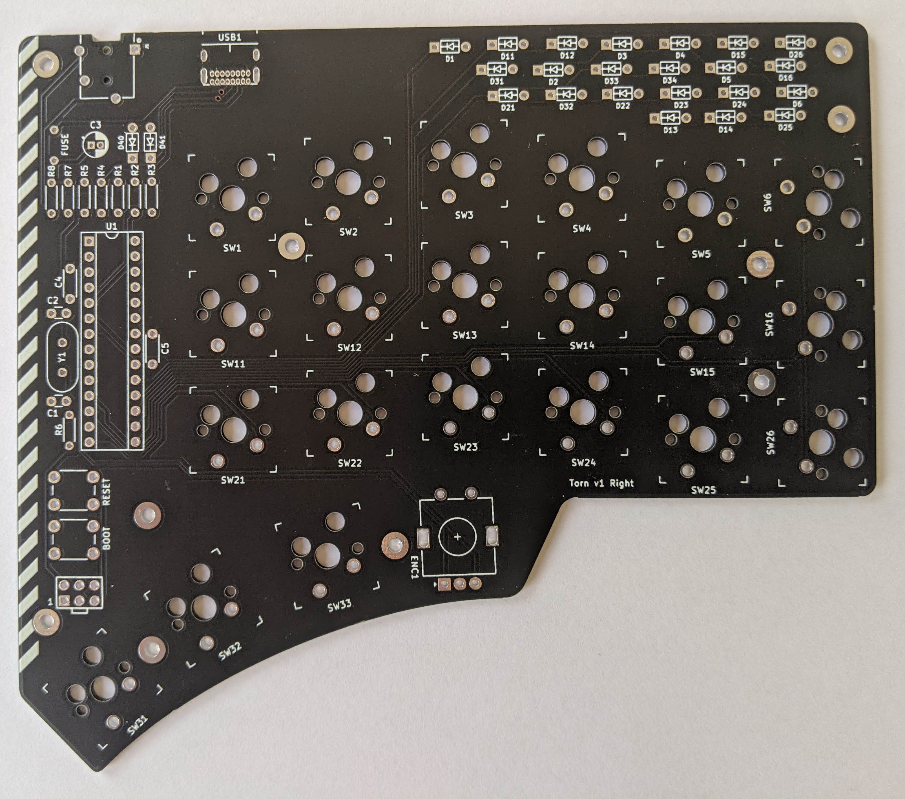
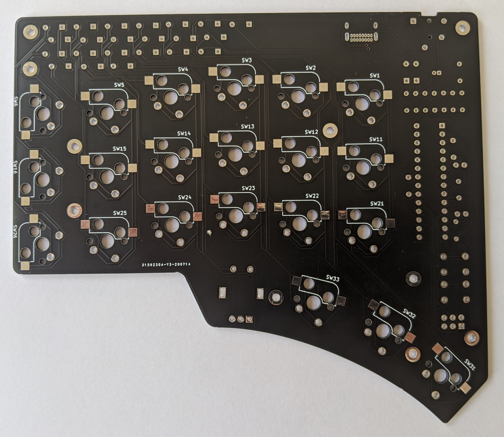
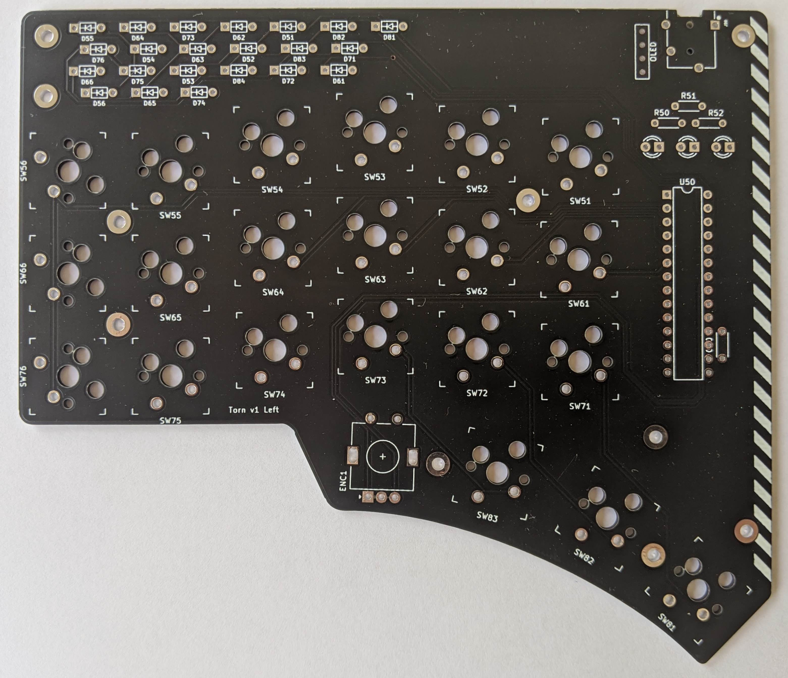
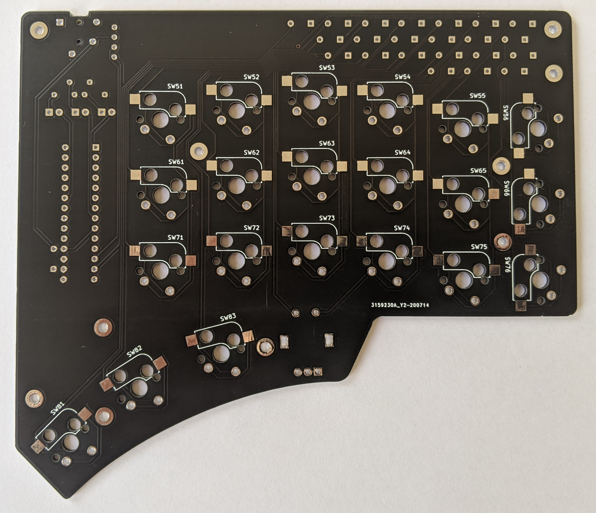

Torn PCBs
===============

## Schematics

[Left schematic](./release/torn_left-schematic.pdf) | [Right schematic](./release/torn_right-schematic.pdf)

[Left interactive BOM](./release/torn_left-ibom.html) | [Right interactive BOM](./release/torn_right-ibom.html)

## Top

 

## Bottom

 

## Plate

 

## V1.0

