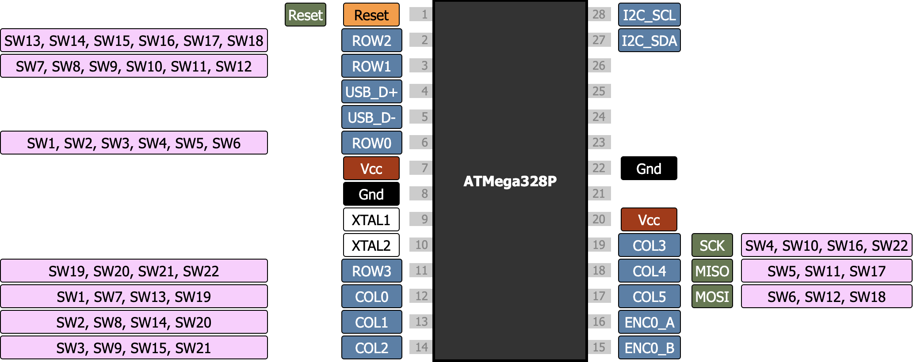
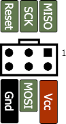
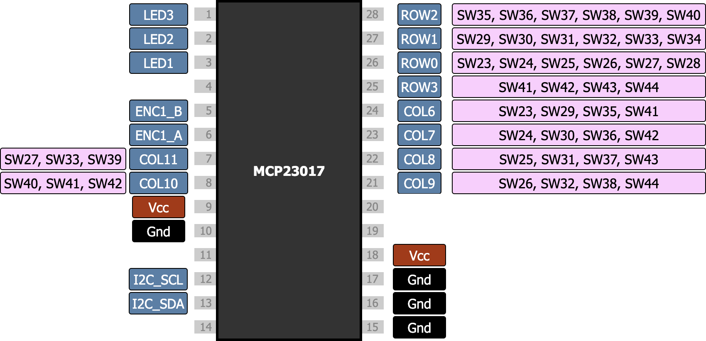

# Troubleshooting

If your Torn keyboard does not work you can look for answers here.
You can also ask questions and get help on the [Torn Discord channel](https://discord.gg/mamAqNccju).

## Primary (left) side

The primary side of the keyboard is on the left. This side include the ATmega328P CPU. The pinout is shown below: 

You can use the primary side of the keyboard on it's own, so unplug the TRRS cable to test.

If the keyboard does not work you should visually check the soldering and look for any shorts between the pins.
Pay special attention to the USB C connector and the 4.7uF Capacitor (C3).

Make sure the you have inserted the ATmega328P on the right side, and that the notch is pointing up.

#### Flashing ATmega328P

If you have trouble flashing the ATmega328P you can check that that programmer is connected correctly.
The ISP header has the following pinout:

You can use a multimeter to check the continuity between the ISP header and the ATmega328P. If necessary re-solder the connection.

- pin 1 (MISO) on the isp header should connect to pin 18 on ATmega328P
- pin 2 (Vcc) on the isp header should connect to pins 20 and 7 on ATmega328P
- pin 3 (SCK) on the isp header should connect to pin 19 on ATmega328P
- pin 4 (MOSI) on the isp header should connect to pin 17 on ATmega328P
- pin 5 (Reset) on the isp header should connect to pin 1 on ATmega328P
- pin 6 (Gnd) on the isp header should connect to pins 22 and 8 on ATmega328P

When the programmer is connected check you have 5v between pin 20 and pin 22 on the ATmega328P.

If you are still having problems you can also carefully remove the ATmega328P and try to [program it directly](https://www.hackster.io/techmirtz/arduino-without-external-clock-crystal-on-atmega328-d4fcc4). 
If this fails you may need to replace the ATmega328P.

## Secondary (right) side

The secondary side of the keyboard is on the right. This side includes the MCP23017 I/O expander. The pinout is shown below:

You have to connect the two halfs of the keyboard together with a TRRS cable.
Make sure you unplug the USB C before disconnecting the TRRS cable - otherwise the connector might short and destroy the chips.

#### I2C

The primary and secondary side communicate over I2C, a serial bus protocol. I2C is used for both the I/O expander and the OLED display.
If nothing works on the secondary side there is a prbolem with the I2C bus.

Check you are using a TRRS cable with four contacts on the plug. The cable supplies Vcc, Gnd, I2C_SCL and I2C_SDA. Note the keyboard will _not_ work with a TRS cable that has only three contacts.

You should also check that the I2C pull-up resistors R7 and R8 are soldered correctly.

With the TRRS cable connected you can check for connectivity between the two halves. If necessary re-solder the connection.

- pin 7 (Vcc) on ATmega328P should connect to pin 9 and 18 on MCP23017
- pin 8 (Gnd) on ATmega328P should connect to pin 10, 15, 16 and 17 on MCP23017
- pin 28 (I2C_SCL) on ATmega328P should connect to pin 12 on MCP23017
- pin 27 (I2C_SDA) on ATmega328P should connect to pin 13 on MCP23017

#### OLED display

The default QMK firmware enables the OLED display. If not does not work you can check for connectivity between the OLED display and MCP23017. If necessary re-solder the connection.

- pin 9 (Vcc) on the MCP23017 should connect to VCC on the OLED display
- pin 10 (Gnd) on the MCP23017 should connect to GND on the OLED display
- pin 12 (I2C_SCL) on the MCP23017 should connect to SCK/SCL on the OLED display
- pin 13 (I2C_SDA) on the MCP23017 should connect to SDA on the OLED display

When the keyboard is powered check you have 5v between VCC and GND on the OLED display.

You can also visually check the display for damage, especially the surface mounted components under the display.

If the connectivity is good you may need to replace the OLED display.
